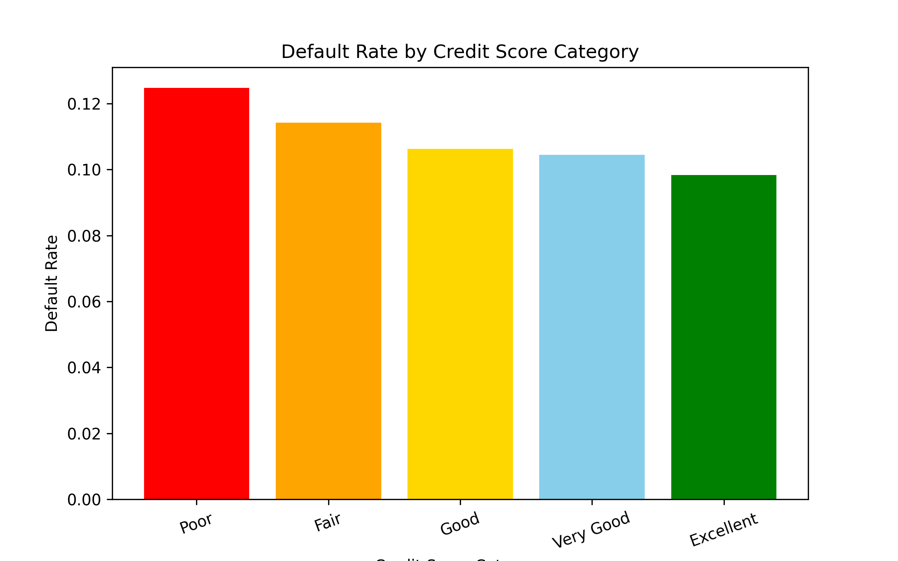

# Identifying Default Risk Earlier Could Help Lenders Make Better Loan Decisions

## Better lending decisions begin with a clearer understanding of which borrowers may be more likely to struggle with repayment

### Problem Statement

When lenders review loan applications, they have to make important decisions without knowing exactly what will happen in the future. This can be difficult because some borrowers may look similar on paper, even though their repayment behavior may lead to very different results. Missed payments and defaults can create financial loss and uncertainty, so it is important to better understand which borrowers may be at higher risk. My specific problem will help to explore how borrower financial information and repayment history can be used to estimate the likelihood of default using a specific default risk score.

### Solution Description

This project looks at borrower data in a structured way to help identify patterns related to default risk. By examining information such as payment history, bill amounts, and credit limits, the project aims to give lenders a clearer view of borrower risk before making a loan decision. The goal is not to replace human judgment, but to support it by providing a more useful and consistent way to recognize which borrowers may need closer attention.

### Chart

The chart below shows how default rates vary across borrower groups, specifically credit score categories. This supports the solution by helping reveal patterns in borrower credit profiles that may be associated with higher default risk. A visualization like this can help lenders better understand which types of borrowers may require closer review before a lending decision is made.

